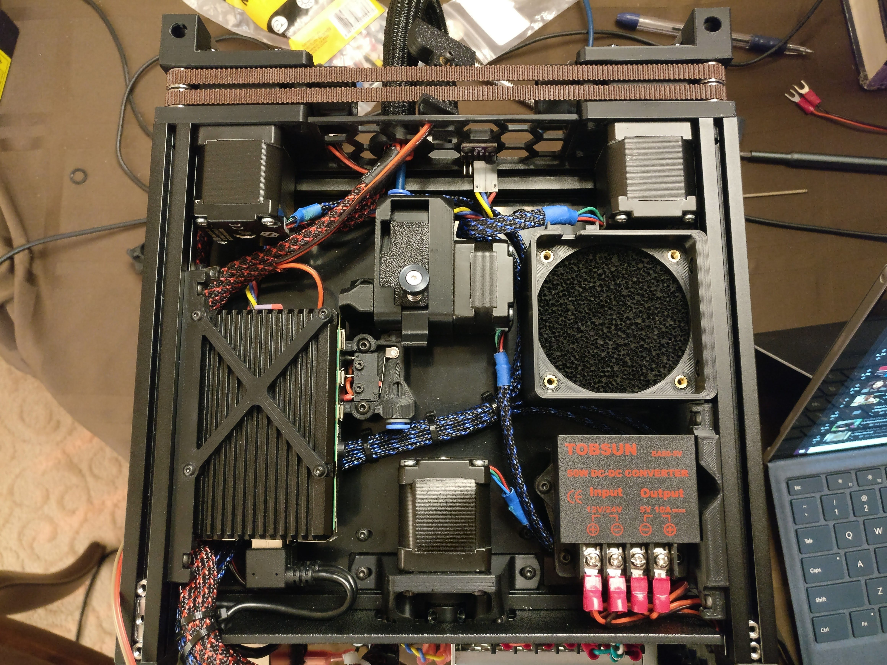

# V0 Chamber Separator


Voron 0 chamber separator with hexagon-forward design to separate the print chamber from rear electronics chamber (while still allowing for airflow between the two) and also functions as a bowden retainer. Includes variation that also allows convenient mounting for BME280 chamber temp/humidity/pressure sensor.

## Files:
Comes in 2 flavors:
1. `chamber_separator.stl`: base version
2. `chamber_separator_bme280.stl`: integrates a BME280 temperature/humidity sensor into one of the hexagons (*Note: might require supports for the sensor pocket cutout*)

## Required Parts:
* M3x6 BHCS (2x) for mounting to the 2 vertical z extrusions
* *Optional:* BME280 temperature/humidity sensor (something like this https://amzn.com/B01N47LZ4P)
* *Optional:* M3x6 BHCS (2x) for mounting BME280 (threads directly into plastic)

## BME280 Configuration:
### Wiring to Raspberry Pi via i2c:
For both RPi 3 and 4B, wire as follows:
VCC --> 1 (3.3V)
GND --> 9 (Ground)
SCL --> 5 (GPIO3 / SCL)
SDA --> 3 (GPIO2 / SDA)

### Configure Raspberry Pi as secondary MCU:
https://github.com/KevinOConnor/klipper/blob/master/docs/RPi_microcontroller.md

### Klipper Configuration:
Add the following lines to your Klipper config
```
# Raspberry Pi 4B
[mcu host]
serial: /tmp/klipper_host_mcu

# BME280 Chamber Temp Sensor
[temperature_sensor chamber_temp_sensor]
sensor_type: BME280
i2c_mcu: host
i2c_address: 118
i2c_bus: i2c.1
gcode_id: C
```

### Usage:
See https://github.com/KevinOConnor/klipper/blob/master/config/sample-macros.cfg for gcode macros
In order to enable chamber temperature to display on your Octoprint Temperature Tab like below, enable `Heated Chamber` in your Octoprint printer profile.


## Notes: 
* Center-to-center distance for mounting to the two vertical z extrusions may vary due to assembly differences. Feel free to modify the included STEP file.
* Supports are included as part of the stl for the BME280 variation, remember to remove them prior to installing the inlet.
* Mounting holes and cutouts are tested for the linked module above only, might not work for other boards.

## Additional Images:
</img> </img> </img> 

