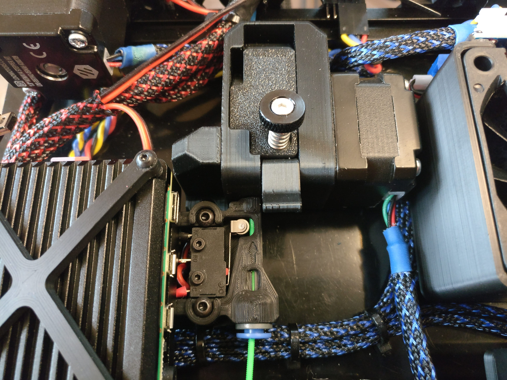

# V0 Filament Runout Sensor

 

Filament runout sensor for Voron 0 using a generic microswitch with a roller lever arm. Runout sensor sits in-line right below the pocketwatch, and mounts via existing pre-load nut for mounting the back panel

## Required Parts:
* Microswitch w/ Roller Lever (https://amzn.com/)
* M3x8 BHCS (2x) for mounting
* Bowden Collet
* Short piece of filament

## Files: 
* `runout_base.stl`: 
* `runout_top.stl`: 

## Notes: 
* 

## Additional Images:
 

 

 

 
