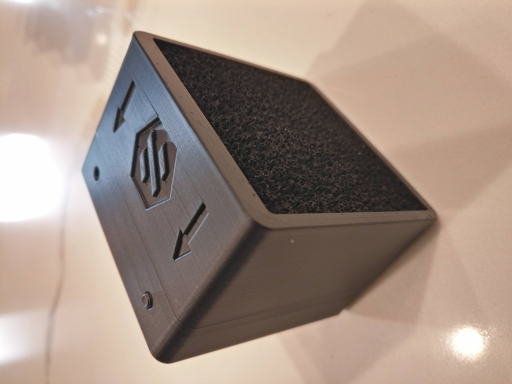
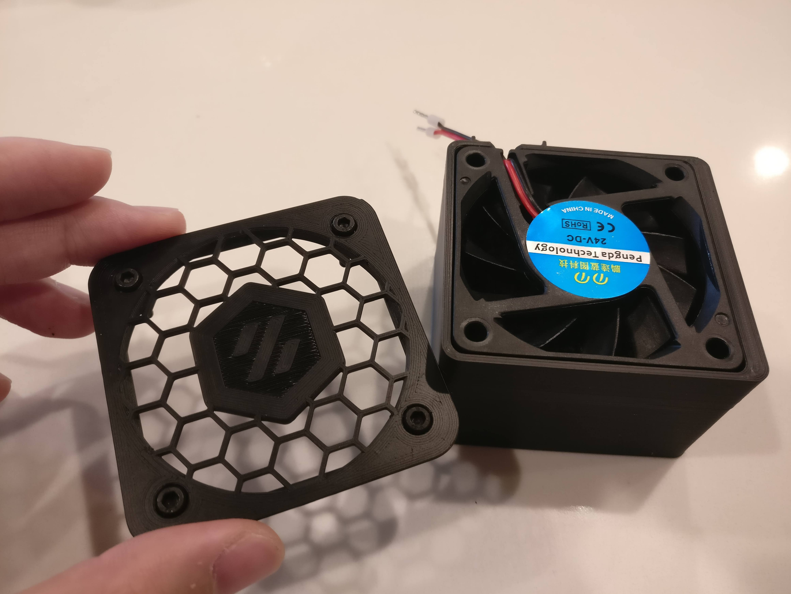
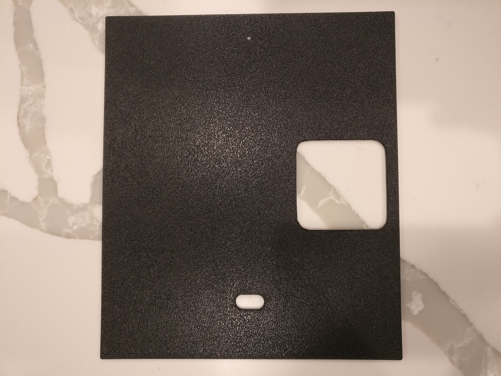

# V0 Filtered Exhaust

Voron 0 filtered exhaust solution that fits nicely inside of the back compartment of the printer. The exhaust uses 6010 axial fan + the V2 BOM spec activated carbon filter. Can't really comment on the efficacy of this solution in removing odors/particles, but the exhaust is pulled through 3 layers of the carbon filter so it's better than nothing... The exhaust requires cutting out a hole in the back panel.

## Files:
* `exhaust_housing.stl`: main body, houses the filter material and 
* `exhaust_housing_11mm.stl`: my 60x10mm fans were somehow 11mm thick
* `exhaust_housing_mosfet_mount.stl`: built-in mounting for the optional mosfet fan control module
* `exhaust_housing_mosfet_mount_11mm.stl`: same as above, except for 11mm thick fans
* `exhaust_fan_cover.stl`: fan cover

## Required Parts:
* Activated carbon filter from V2 spec (https://amzn.com/B07KWYTCG5)
* 60x60x10 Fan
* M3x6 BHCS + M3 Nut (2x) for mounting to frame extrusion
* M3x16 BHCS (4x): for mounting fan cover
* M3 heatset insert (4x): for mounting fan
* *Optional:* Mosfet module (https://amzn.com/B07D1W6VFS): for PWM fan control, since the SKR mini doesn't have many extra fan control headers
* *Optional:* M2x4 self-tapping screws: for mounting mosfet module (just snip BOM M2x10 self-taping screw in half)

## Installation Instructions: 
1. Install 4 M3 heatset inserts
2. Cut 1 sheet of the carbon filter material into 4 equal squares, stuff the `exhaust_body` with 3 layers from the bottom. Make sure the top layer of carbon doesnt rub against the fan
3. Mount `exhaust_housing` to frame extrusion before installing fan. 
3. Cut 63x63 square hole (with 16mm filleted corners) into the back panel at the appropriate location, depending on where you mount the exhaust. See pictures below.
4. Insert fan into housing (pull configuration, such that airflow vents OUT of printer), mount back panel, mount fan cover, then insert mounting screws to sandwich the entire assembly together

## Notes:
* When removing back panel for maintenance, remember to unscrew the 4 fan cover screws

## Additional Images:
</img> </img> </img> 
</img> </img> </img>
</img> </img> 