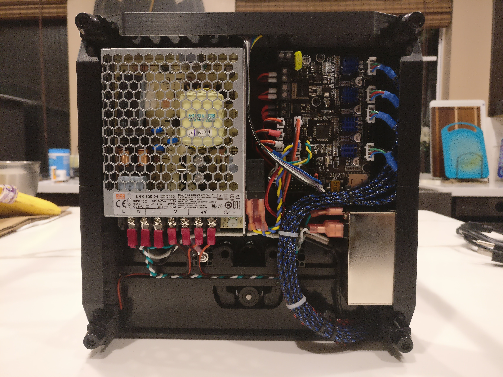

# V0 Switched, Filtered, and Fused Inlet Skirt

This inlet skirt is designed to specifically house the snap-in filtered & fused c14 inlet listed below. The inlet snaps in flush to maintain a low profile and match the aesthetics of the existing skirts. The skirt itself has some very thing walls since there is not much available space, but so far strength and stiffness havent been an issue (just be careful not to plug in the power cord too hard). Due to the large footprint of the filtered inlet, repositioning of the power supply, skr mini, and 5v converter is necessary. I mounted my inlet on the right side of the printer, and had to swap the positions of the power supply and skr mini, and move the 5v converter to the back of the printer. 

## Required Parts:
* C14 Filtered Inlet (https://amzn.com/B009180QPQ)
* Fuse (2A should be enough)
* M3x8 BHCS + M3 Nut (2x) for mounting (same as spec skirt mounting)

## Files: 
* `inlet_skirt.stl`: for mounting the inlet on the right side of the printer
* `inlet_skirt_mirrored.stl`: for mounting the inlet on the left side of the printer

## Notes: 
* Supports are included as part of the stl, remember to remove them prior to installing the inlet.

## Additional Images:

</img> </img> </img> 
</img> </img> </img>
</img>  